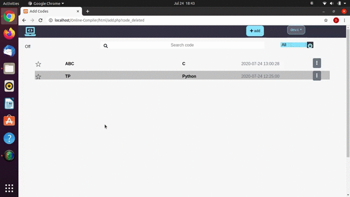

# Online-Compiler
This Web App supports execution of Programs for 4 different languages without any setup required on client device.
 
<b>The languages supported are as follows:</b>
<ul>
<li>C</li>
<li>C++</li>
<li>Java</li>
<li>Python</li>
</ul>
 
<b>Features:</b>
<ul>
<li>Supports 4 languages</li>
<li>Download or execute the code anytime</li>
<li>Autosaving of files</li>
<li>Code Execution on virtual environment on server</li>
</ul>
 
<b>Demo</b>

